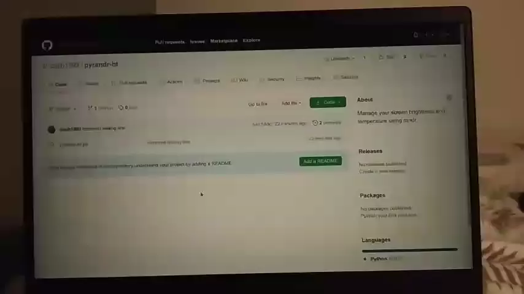

# xscreenfilter

Protect your eyes. Manage your screen brightness and temperature in **linux**.

This script lets you apply screen filters that modify your screens' apparent brightness and [temperature](https://en.wikipedia.org/wiki/Color_temperature).

For ease of access, assign the script to global hotkeys using your OS hotkeys manager. You can also use it from the terminal or from a Python script if that's your goal.

This script does not change the actual hardware brightness, also called backlight. For backlight, I recommend the `brightnessctl` command.

## How to install and use?

Run `pip3 install xscreenfilter` and `python3 -m xscreenfilter --demo`.

To get a list of available options, use `python3 -m xscreenfilter --help`.

Particularly, the `-c` argument alters both brightness and temperature (`c`ombined). You can use it to make the screen

 - 'darker and warmer' (`python3 -m xscreenfilter -c -5`), or
 - 'lighter and cooler (white)' (`python3 -m xscreenfilter -c +5`).

Assign them to some global hotkeys for the best experience.

## Motivation of this script

 - We spend many hours on the screen.
 - Screens are too bright, even on 1% backlight.
 - `xrandr` supports brightness but not temperature: there is a `--gamma` option but colors look very strange if you use it.
 - `redshift` supports setting both, but not reading, increasing or decreasing. It is meant for automated use only, making things darker at night. In my opinion, it is more practical to let the user change it directly, because if the window is closed during the day or the lights are on during the night, the automated system stops being useful. Furthermore, `redshift` has tons of dependencies and uses your location by default. In my opinion, it is too complex for such a simple task.
 - No other open source software is available.

## Demo video

I wished I could record the screen from the screen recorder, but screen recorders can't see the screen filters that are applied.

## Installation without pip

(You still need python3)

1. Install `python3-xlib` with your OS package manager, e.g. `sudo apt install python3-xlib`.
1. Download this project and unzip in your preferred location.
1. Run it with `python3 ...your-location.../xscreenfilter/__main__.py ...arguments...`.
